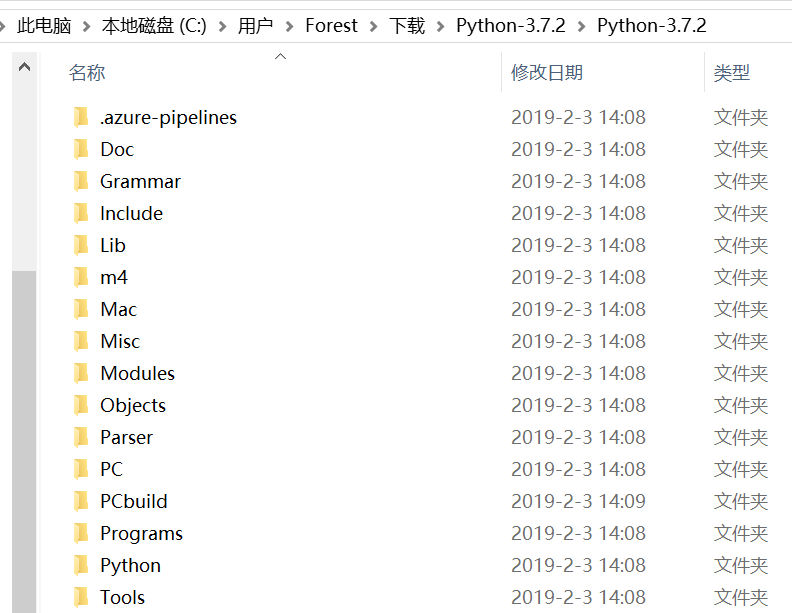

# Understanding Cpython Virtual Machine </center>
## 1. Cpython源码和架构
### 1.1 CPython总体架构
Cpython是python语言最常用的解释器，是用C语言编写的。
Cpython 3.7.2 源代码结构如下：

* Include: python 提供的所有头文件，如果用户需要用C/C++编写自定义扩展，需要用到这些头文件。
* Lib: python 自带的标准库，用Python语言编写。
* Modules: 包含所有用C语言编写的模块，这些模块对速度要求非常严格。
* Parser: Python解释器中进行词法和语法分析的部分。
* Objects: 包含所有python内建对象，例如：list，dict等。
* Python: 包含Python解释器中的编译和执行引擎，是python的核心。
* 
### 1.2 Cpython总体架构
总体架构包含三大块：
* File Groups: 核心Modules，公共库，用户自定义模块等。
* Python核心模块：Python解释器，包含Scanner，Parser，Compiler， Code Evaluator（就是执行器）。
* 运行环境：Object/Type 结构，内存分配器，current state of Python

***

## 2. Python对象
### 2.1 Python对象初探
python中，一切都是对象。整数，字符串，类型，函数等都是对象。
* python中， 对象的基石是PyObject类型
```
typedef struct _object {
    _PyObject_HEAD_EXTRA
    Py_ssize_t ob_refcnt;
    struct _typeobject *ob_type;
} PyObject;

PyObject_HEAD                   PyObject ob_base;
```
* 其他内置对象通常包含PyObject_HEAD内容，例如：
```
typedef struct {
    PyObject_HEAD
    double ob_fval;
} PyFloatObject;
```

### 2.2 整数对象
### 2.3 字符串对象
### 2.4 List对象
### 2.5 Dict对象

***
## 3. Python虚拟机
### 3.1 Code对象与pyc文件
### 3.2 python虚拟机框架
### 3.3 虚拟中的一般表达式
### 3.4 虚拟机中的控制流
### 3.5 虚拟机中的函数
### 3.6 虚拟机中的类机制

***

## 4. Cpython的高级话题
### 4.1 Python运行环境初始化
### 4.2 Python模块的动态加载
### 4.3 Python多线程机制
### 4.4 Python的内存管理机制

***
**其他链接**
1. [暨南大学](https://www.jnu.edu.cn/)
2. [林龙新的教学网站](https://icerg.longxinlin.com)
3. [python官方网站](https://www.python.org)

**文档维护人名单：**

编号| 姓名  | 单位
----|-----|---
1|Forest Lin| Jinan University
2|Steven Lin| Middle School affiliated to Guangzhou University


